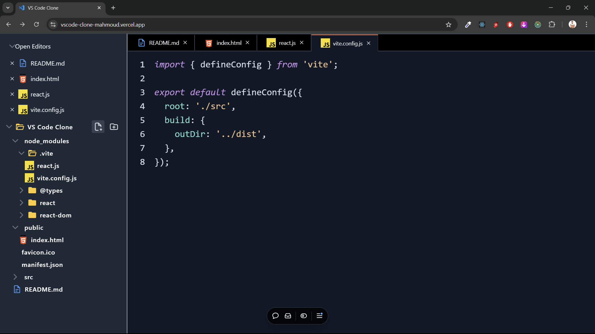

# VS Code Clone 🚀

Welcome to the VS Code Clone project! This project is a frontend application built using React and TypeScript, showcasing the basics of Redux Toolkit and recursion. It mimics the core functionalities of Visual Studio Code's interface, providing a foundation to learn and expand on advanced UI interactions.

**Live Demo:** https://vscode-clone-mahmoud.vercel.app/



## Introduction 📜

The VS Code Clone is designed to replicate the familiar file explorer interface of Visual Studio Code. This project focuses on leveraging modern web technologies to achieve a dynamic and interactive user experience. It also highlights the usage of Redux Toolkit to manage application state efficiently and demonstrates recursion for handling hierarchical data like file trees. Dive in to explore its features and code structure! 💪

## Features ✨

- **File Explorer:**
  - Create, read, and manage files and folders in a hierarchical structure.
  - Add new files or folders dynamically with validation.
  - Toggle between opened files and preview their content seamlessly.

- **Interactive Panels:**
  - Resizable panels for enhanced UI flexibility.
  - Smooth transitions and animations powered by Tailwind CSS.

- **State Management:**
  - Implemented with Redux Toolkit for scalable state management.
  - Demonstrates advanced patterns using slices and actions.

- **Recursion in UI:**
  - Utilizes recursion to render nested file structures dynamically.

- **Custom Components:**
  - Context menus for file operations.
  - File icons that adapt based on file type and state.

- **Accessibility & Performance:**
  - Built with accessibility in mind to ensure an inclusive experience.
  - High-performance UI leveraging Vite and optimized React rendering.

## Technologies Used 🛠️

This project incorporates the following technologies:

- ⚛️ **React.js:** A JavaScript library for building user interfaces.
- 🚀 **Vite:** A fast build tool for modern web applications.
- 🌐 **TypeScript:** A statically-typed superset of JavaScript.
- 🎨 **Tailwind CSS:** A utility-first CSS framework for rapid UI development.
- 🛠️ **Redux Toolkit:** A modern approach to managing global state.
- ✨ **React Resizable Panels:** For creating resizable UI elements.
- 🔢 **UUID:** A library for generating unique identifiers.
- 🖋️ **React Syntax Highlighter:** For rendering code snippets beautifully.

## Demo 🌐

Stay tuned for the live demo click [Here](https://vscode-clone-mahmoud.vercel.app/)! This section will showcase the power and functionality of the VS Code Clone once deployed. 🚀

## Getting Started 🚀

To run the project locally, follow these steps:

1. 🧪 Clone the repository:
   ```bash
   git clone https://github.com/your-username/vscode-clone.git
   ```
2. 📂 Navigate to the project directory:
   ```bash
   cd vscode-clone
   ```
3. 📦 Install the dependencies:
   ```bash
   npm install
   ```
4. ▶️ Start the application:
   ```bash
   npm run dev
   ```
5. 🌐 Open your browser and visit:
   ```
   http://localhost:3000
   ```

Now you can start exploring the VS Code Clone and experiment with its features. Enjoy! 🎉

## Contributing 🤝

Contributions are welcome! If you have suggestions, bug reports, or feature requests, please open an issue or submit a pull request. Let's collaborate to make the VS Code Clone project even better! 🙌

Thank you for using the VS Code Clone project and for your contributions. Together, we can build a powerful and flexible developer tool! 💫

